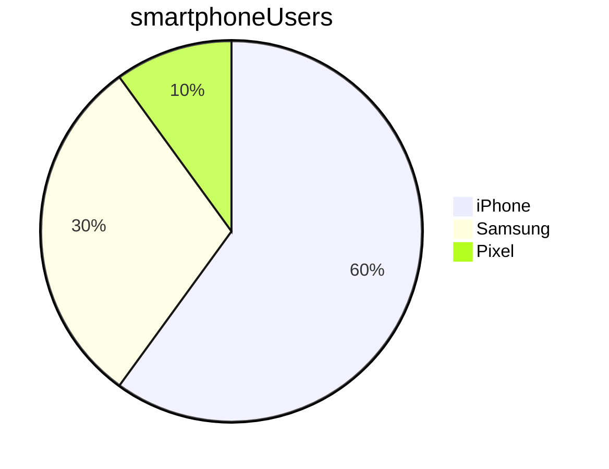

# Markdown

## Markdown basics

### Subheadings

use hashes

### Marking code

This is how you print something to the screen in Python: `print ("hello")`

This is how you show a code block:
```python
print("hello")
print("my name is sam")
```

### showing a special note

> Note: This is a great way to make a note stand out


### Lists

* bullet point 1
  * Sub point 1

  <br>

1. item 1
   1. sub item 1 
2. item 2
   - point to do with item 2

>note: 
> 
> if sequence is important, use numbered steps.

- [ ] Apples
- [ ] Bread
- [ ] Banana
   
### Highlighting text

This is how to do **Bold** 

This is how to do _Italics_

### Images


### Links

Click here to go to [Google](https://google.com)

### Extra Markdown

### Tables


| Name  | Street      | Town       |
|-------|-------------|------------|
| Cathy | Main St     | Birmingham |
| John  | Maple Drive | Stafford   |

### Mermaid for charts




### Comment out something
 command /

[//]: # (need to comment this out )


